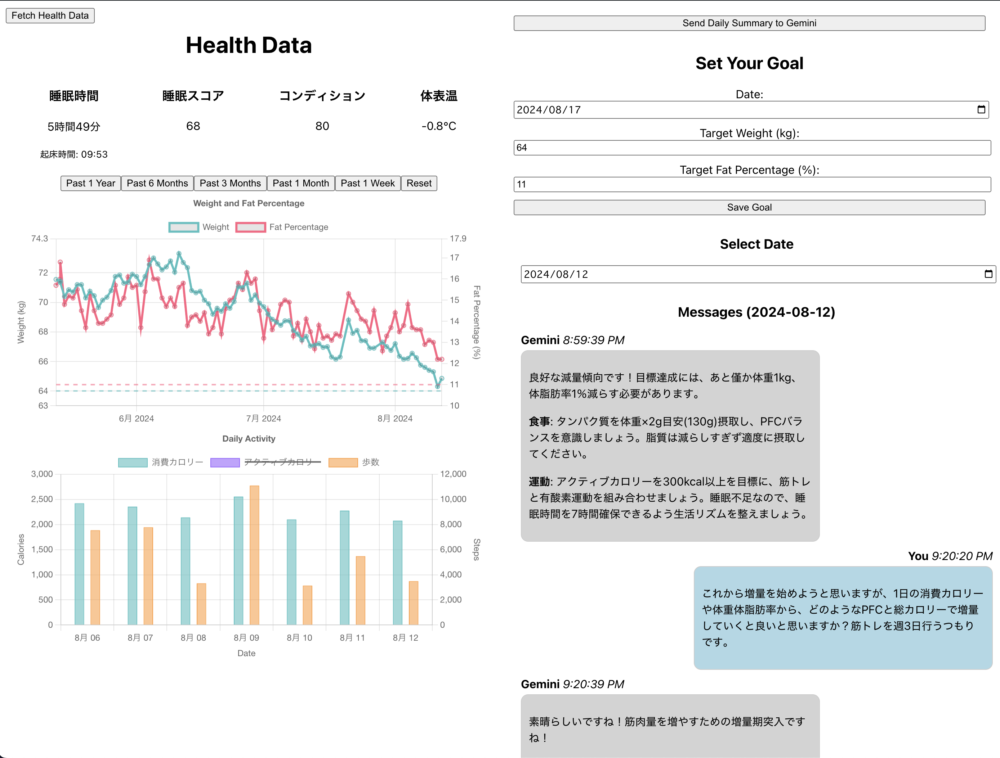

# ①課題番号-プロダクト名

Health-Dashboard

## ②課題内容（どんな作品か）

- 自身の体組成・睡眠・運動データを自動保存して可視化を行い、自分で設定した目標に合わせたフィードバックをGemini1.5Proが行ってくれるサイト
- 取得元はOuraringとHealthPlanet

## ③DEMO
- さくらサーバ
    -  https://tech-yusuke.sakura.ne.jp/health-dashboard/
-  

## ④作ったアプリケーション用のIDまたはPasswordがある場合
なし
<!-- - ID：dev@challenge-project.com
- PW：zK2n*N_m -->

## ⑤工夫した点・こだわった点
- Reactフレームワークを利用してレスポンシブ含むUI・UXを意識したwebサイトを作成した。
  - 構成
    - フロント
      - React
    - バックエンド（API）
      - GoogleCloudFunctions
        - ヘルスデータ取得API
        - Gemini問い合わせAPI
    - バックエンド（DB）
      - RealtimeDB
- ボタンひとつで外部のAPI（Health・Dashboard）から最新データを取得し、リアルタイムでサイトを更新できるようにした。
- ChatbotArenaで評判の高性能な生成AI（Gemini 1.5 Pro）を利用できるようにした。
- 最近のデータやその日のチャットを含んだ状態でAIが返信してくれるようにした。
- 以前に引き続き、NewRelicを導入した。

## ⑥難しかった点・次回トライしたいこと(又は機能)
- 難しかった点
    - 今までの課題で利用していたAWSを利用せず、GoogleCloudのみでバックエンドを構成した点。
    - APIキーをフロントに渡さないようにGCFを利用してリクエストを行うようにした点。
- 次回トライしたいこと
  - 食事内容の記録も収集して、1日ごとのカロリー収支情報も可視化できるようにしたい。
    - GoogleHealthもしくはAppleHealthcareの情報を取得できそうなのでそちらを試したい。
  - セキュリティがほぼないに等しいので、早急に改善したい。
    - サイトアクセス
      - Googleアカウントログインを必要とする
    - RealTimeDB
      - 読み込み
        - Googleアカウントログイン or GoogleCloudFunctionsのみ許可
      - 書き込み
        - Googleアカウントログインの場合Chatと目標の書き込みのみ許可
        - CloudFunctionsの場合全て許可
    - GoogleCloudFunctionsへのリクエスト
      - Googleアカウントサイトにアクセスしている場合のみ許可

## ⑦質問・疑問・感想、シェアしたいこと等なんでも
- [感想]
  - 自分が普段利用しているOuraringとタニタの体重計のデータがAPIで利用できることは知っていたが、実際に使う機会はなかったのでこの機会にサービスに組み込むことができて良かった。
  - Firebaseを利用することでとても簡単にリアルタイムのデータ処理を実現できることがわかり、Reactを利用すると簡単にコンポーネントを分けてサイトを作成できることがわかった。
  - バックエンドとの連携についても試行錯誤しながら、headerやメソッド、CORS等の理解が深まったと思う。Postman便利。
- [参考記事]
  - HelathPlanetのAPI利用
    - https://zenn.dev/kou_pg_0131/articles/tanita-health-planet-api
  - OuraRingのAPI利用
    - https://zenn.dev/ukkz/articles/16df9e2185ea6e
  - Vertex AI API利用（Gemini）
    - https://cloud.google.com/vertex-ai/generative-ai/docs/migrate/migrate-google-ai?hl=ja